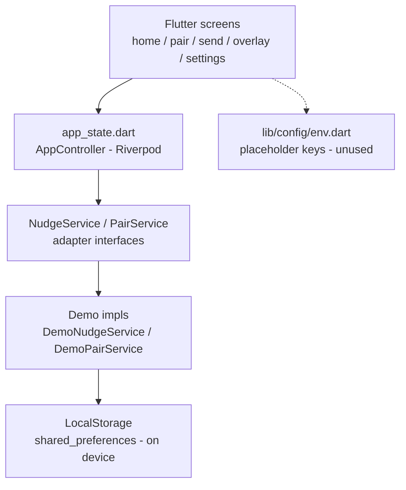
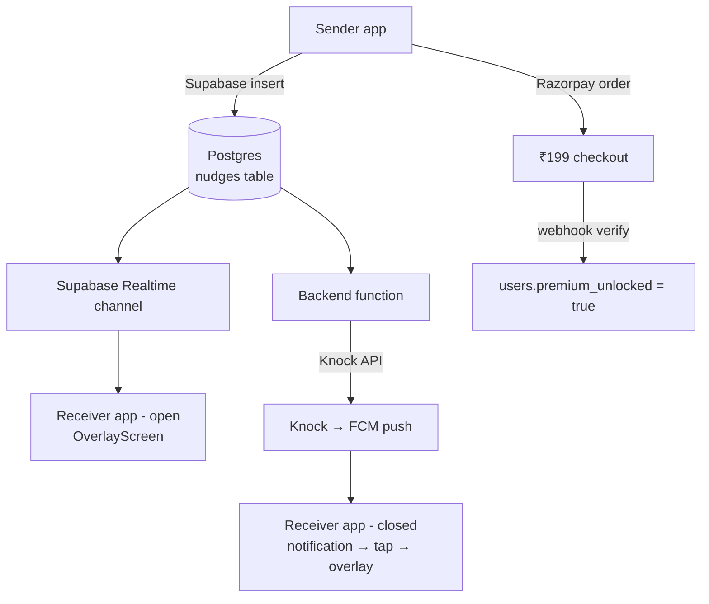
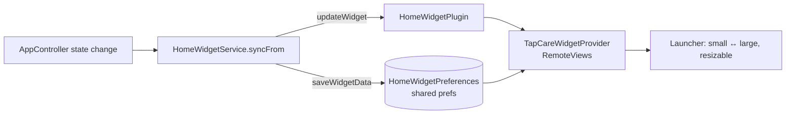

# Architecture

## Current build (demo/local mode)

- **Presentation:** `lib/screens/*` + `lib/widgets/*` — Material 3, warm
  pastel theme, Hindi/English strings from `lib/config/strings.dart`.
- **State:** a single Riverpod `Notifier` (`AppController`) owns profile,
  pair, nudges, locale and theme. Screens never touch storage directly.
- **Service layer:** `NudgeService` / `PairService` interfaces in
  `lib/services/backend_services.dart`. Only demo (local) implementations
  exist; swapping in a backend never touches UI code.
- **Persistence:** `LocalStorage` wraps `shared_preferences` (JSON blobs).

## How a nudge travels today (demo)

1. Sender taps a preset (or writes a custom message) → `AppController.sendNudge()`.
2. `DemoNudgeService.sendNudge()` prepends the row and persists the capped
   list (max 20).
3. For the **incoming** demo, "Simulate incoming nudge" creates a row with
   `senderId = demo_incoming` and pushes `OverlayScreen`.
4. `NudgeOverlay` plays the float-in + drift animation; the sender chip and
   message are rendered from the nudge's theme + text.
5. Tapping **Seen ❤️** → `AppController.markSeen()` sets `seen_at`, the
   route pops, and the list shows the ✓ badge.

## Planned (not built — keys required)

- **Supabase** — Postgres, OTP/magic-link auth, Realtime for live delivery.
- **Knock → FCM** — push when the receiver's app is closed (Knock dashboard
  connects the FCM credentials; no second push provider).
- **Razorpay** — ₹199 one-time unlock; order created server-side, signature
  verified before setting `premium_unlocked`.

## CI/CD

`.github/workflows/build-apk.yml` runs on push to `main`:
checkout → Flutter 3.35.5 (pinned) → `pub get` → `analyze` → `test` →
`build apk --debug` → upload `tapcare-apk` artifact (downloadable from
the Actions run page).

## Home-screen widget

`home_widget` bridges Dart → the launcher. Flutter cannot render inside a
`RemoteViews` widget, so the data is flattened instead:

- Dart: `lib/services/home_widget_service.dart` writes ~15 string keys
  (partner, love meter, streak, latest nudge, quote) and requests a redraw.
- Native: `TapCareWidgetProvider.kt` reads those keys and inflates
  `tapcare_widget_small.xml` or `tapcare_widget_large.xml` depending on the
  granted size, with a one-shot `RemoteViews` reveal animation.
- Resizing is declared in `res/xml/tapcare_widget_info.xml`
  (`resizeMode="horizontal|vertical"`, 110dp → 450dp).
- All widget calls are wrapped in try/catch — a widget can never break the app.
